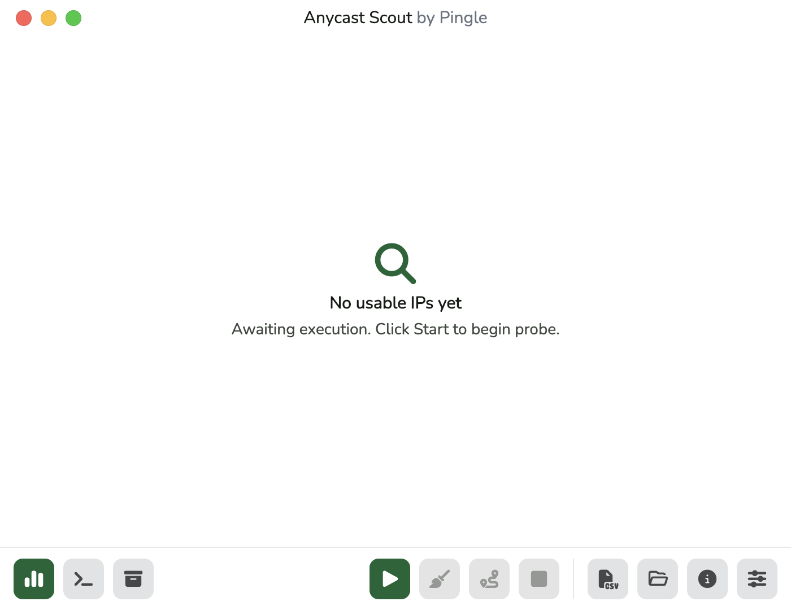

# Anycast Scout GUI

> [!WARNING]
> **In Development / Alpha.** Anycast Scout GUI is under active development.
> UX, bundled backend behavior, and release artifacts may change before a stable
> release. Review generated targets and configs before using them in production
> workflows.

Flutter desktop app for running Anycast Scout backend workflows without leaving
the desktop.



| Area | Details |
| --- | --- |
| Platforms | Linux, macOS, and Windows desktop bundles |
| Backend | Bundled Rust `anycast-scout` binary |
| Workflow | discovery, scan, Connect URLTest, artifacts, sessions |
| Private config | User-selected sing-box JSON file via Browse |

## Run

```bash
flutter pub get
flutter run -d macos
```

Build the backend first, or point Settings -> Core at an existing binary:

```bash
cd ../anycast-scout
cargo build --release --locked
```

The app prefers a bundled backend, then a sibling backend checkout, then
`anycast-scout` from `PATH`.

## Connect Config

The GUI does not bundle sing-box credentials or ready-to-use sing-box configs.
Choose your private JSON config in Settings -> Core with the Browse button before
running Connect checks. Local `config.json`, `.env*`, and sing-box-style JSON
files are ignored by default.

## Verify

```bash
flutter pub get --offline --enforce-lockfile
dart format --output=none --set-exit-if-changed .
flutter analyze --no-pub
flutter test --no-pub
```

CI uses the configured `PUB_CACHE` and `--enforce-lockfile` for repeatable
dependency resolution from the checked-in lockfile.
